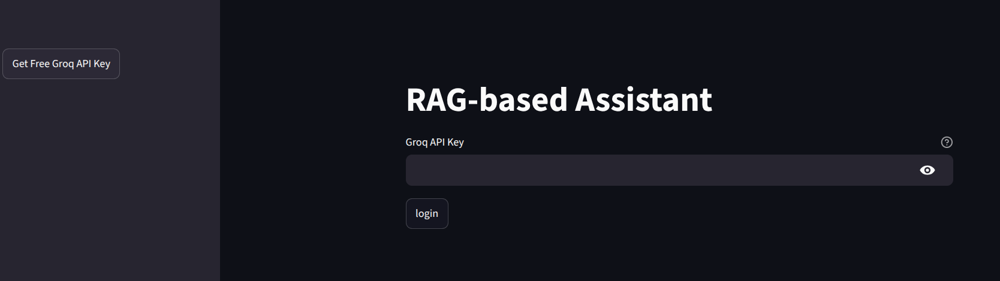
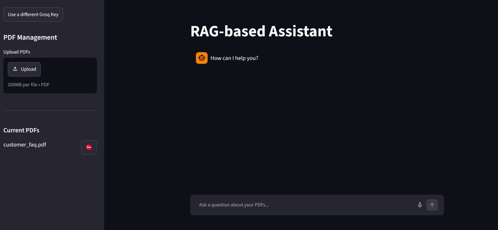
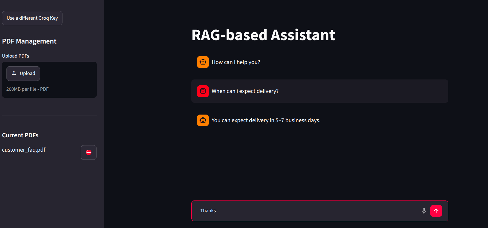

---

# PDF RAG Customer Service Assistant

A Retrieval-Augmented Generation (RAG) application built with SmolAgents, LangChain, FAISS, and Streamlit.

The assistant answers customer questions by retrieving relevant information from uploaded PDF documents and using a Large Language Model hosted on **Groq** to generate grounded responses.

---

## Features

* PDF document ingestion
* Automatic text chunking
* Semantic search using embeddings
* FAISS vector database for retrieval
* SmolAgents tool-based architecture
* Groq-hosted OpenAI-compatible LLM integration
* Streamlit web interface
* Retrieval-Augmented Generation (RAG)
* Uses whisper-large-ve-turbo for STT
* Uses canopylabs/orpheus-v1-english for TTS

---

## Architecture

```text
PDF Documents
      │
      ▼
PyPDFLoader
      │
      ▼
Text Chunking
      │
      ▼
Embeddings
(sentence-transformers/all-MiniLM-L6-v2)
      │
      ▼
FAISS Vector Store
      │
      ▼
Custom Retriever Tool
      │
      ▼
SmolAgents CodeAgent / ToolCallingAgent
      │
      ▼
Groq OpenAI-Compatible API
      │
      ▼
Answer Generation
```

---

## Tech Stack

* Python
* Streamlit
* SmolAgents
* LangChain
* FAISS
* Groq API (OpenAI-compatible endpoint)
* Sentence Transformers
* PyPDF

---

## Installation

Clone the repository:

```bash
git clone https://github.com/AnkitAcharya01/rag-agent.git
cd rag-agent
```

Create and activate a virtual environment:

Linux / MacOS:

```bash
python -m venv .venv
source .venv/bin/activate
```

Windows:

```bash
python -m venv .venv
.\.venv\Scripts\Activate.ps1
```

Install dependencies:

```bash
pip install -r requirements.txt
```

---

## Project Structure

```text
project/
│
├── app.py
├── requirements.txt
├── pdfs/
│   ├── sample.pdf
│   └── ...
│
└── README.md
```

---

## Create a FREE Groq API Key (IMPORTANT)

This application uses the **Groq API (OpenAI-compatible endpoint)** and requires an API key.

### Step 1: Create a Groq Account
*You can do this directly through the link at streamlit login screen.*

Sign up or log in at:

[https://console.groq.com](https://console.groq.com)

---

### Step 2: Generate an API Key

1. Go to the Groq Console
2. Navigate to **API Keys**
3. Click **Create API Key**
4. Copy the key securely

It will look like:

```text
gsk_xxxxxxxxxxxxxxxxxxxxxxxxxxxxx
```

---

### Step 3: Configure Environment Variable

You can store it in a `.env` file:

```bash
GROQ_API_KEY=gsk_xxxxxxxxxxxxxxxxxxxxx
```

Or export it directly:

Linux / Mac:

```bash
export GROQ_API_KEY=gsk_xxxxxxxxxxxxx
```

Windows:

```bash
set GROQ_API_KEY=gsk_xxxxxxxxxxxxx
```

---

### Security Note

* Never commit your API key to GitHub
* Never expose it in frontend code
* Rotate the key if it is accidentally leaked

---

## Usage

You can upload your custom PDF documents directly from the Streamlit interface.

No need to modify internal files.

Default PDFs are included for a sample ecommerce assistant.

You can remove them and **upload your own PDFs**.

---

Run the application:

```bash
streamlit run app.py
```

Open the URL shown in the terminal.

First startup may take a few seconds.

Then you will reach the interface.

---


## Example Interaction

Example (default dataset is an ecommerce store called MeroTech):

```text
Which phone brands are listed here?
```

The assistant will:

1. Search the PDF knowledge base
2. Retrieve relevant document chunks
3. Generate a response using Groq-hosted LLM

---

## Conversation History

You can continue conversations without repeating context. The agent maintains chat history during the session.

---

## Example Questions

* What is the return policy?
* How long does shipping take?
* What warranty options are available?
* What payment methods are supported?
* How can I request a refund?

---
## Talk to it

You can use the microphone button at the right side of the textbox to start audio input.
Currently only english is recommended.
The agent speaks what it generates as response, which you can see in a bubble.
If you dont want to hear it speak, you can turn off the **Audio Playback** toggle in the sidebar.

## Database logging for out-of-bound queries

When you ask a question that the Agent cant find in the pdfs you posted, it informs you that it was unable to retrieve the information.
Under the hood, it logs that specific query into the database, which can be used to improve the documents for future.


## Future Improvements

* Conversation memory (done)
* Custom PDF upload through the UI (done)
* Multi-PDF source citations
* Hybrid retrieval (BM25 + semantic search)
* Persistent FAISS index
* Support for multiple LLM providers
* Voice Support(done)

---

## Learning Objectives

This project was built to explore:

* Retrieval-Augmented Generation (RAG)
* Semantic search
* Vector databases
* Tool calling with SmolAgents
* Agent-based workflows
* Streamlit application development
* Cloud-hosted LLM integration via Groq

---

## License

MIT License
