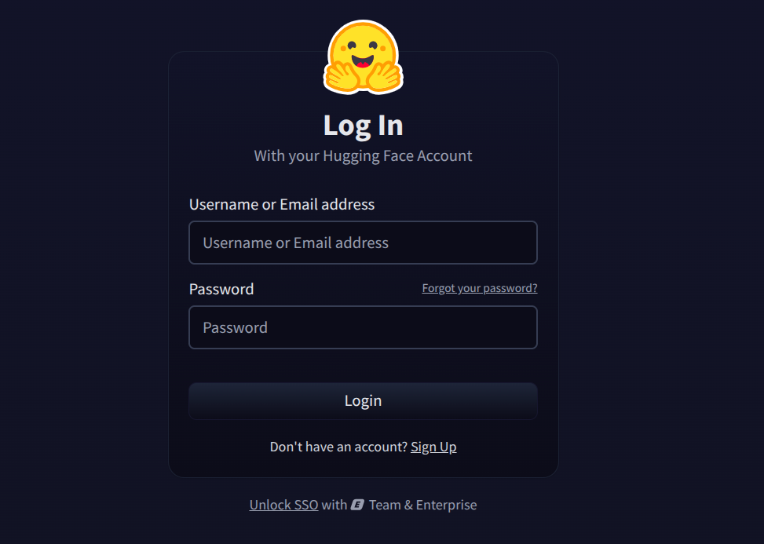
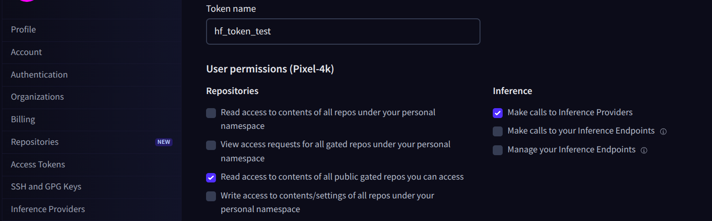
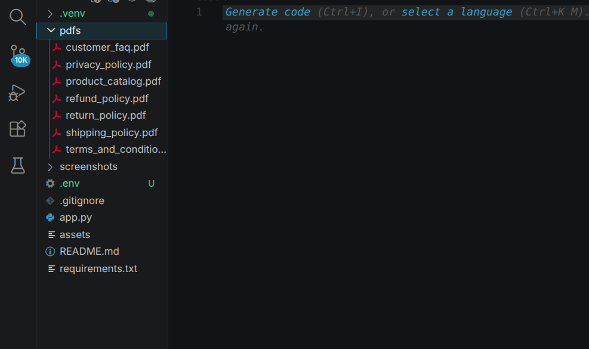
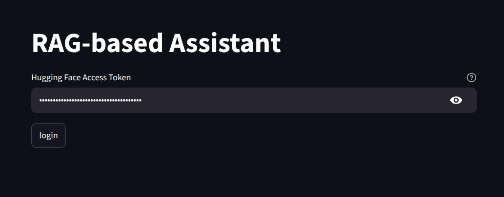
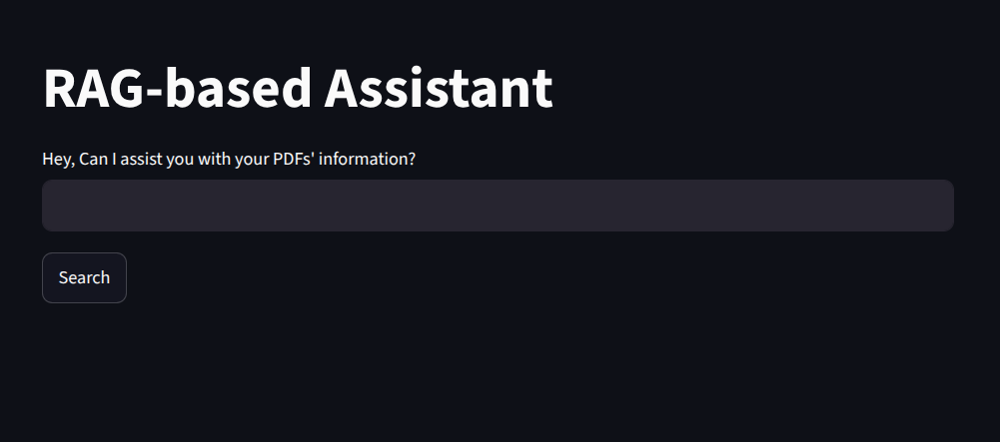
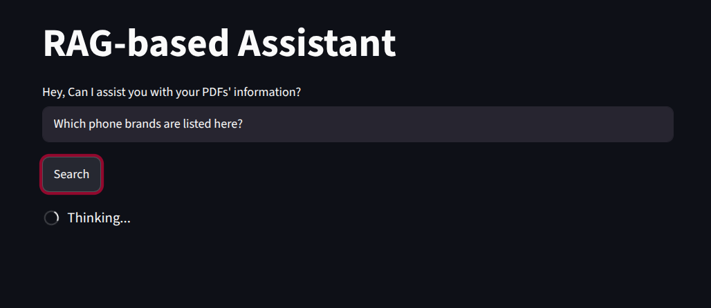
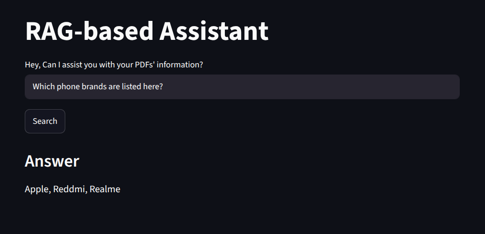

# PDF RAG Customer Service Assistant

A Retrieval-Augmented Generation (RAG) application built with SmolAgents, LangChain, FAISS, and Streamlit.

The assistant answers customer questions by retrieving relevant information from uploaded PDF documents and using a Large Language Model to generate grounded responses.

---

## Features

* PDF document ingestion
* Automatic text chunking
* Semantic search using embeddings
* FAISS vector database for retrieval
* SmolAgents tool-based architecture
* Hugging Face Inference API integration
* Streamlit web interface
* Retrieval-Augmented Generation (RAG)

---


## Architecture

```text
PDF Documents
      │
      ▼
PyPDFLoader
      │
      ▼
Text Chunking
      │
      ▼
Embeddings
(sentence-transformers/all-MiniLM-L6-v2)
      │
      ▼
FAISS Vector Store
      │
      ▼
Custom Retriever Tool
      │
      ▼
SmolAgents CodeAgent
      │
      ▼
Hugging Face Inference API
      │
      ▼
Answer Generation
```

---

## Tech Stack

* Python
* Streamlit
* SmolAgents
* LangChain
* FAISS
* Hugging Face Inference API
* Sentence Transformers
* PyPDF

---

## Installation

Clone the repository:

```bash
git clone https://github.com/AnkitAcharya01/rag-agent.git
cd rag-agent
```

Create and activate a virtual environment:

Linux/ MacOS:
```bash
python -m venv .venv
source .venv/bin/activate
```
OR
Windows:
```bash
python -m venv .venv
.\.venv\Scripts\Activate.ps1   
```


Install dependencies:

```bash
pip install -r requirements.txt
```

---

## Project Structure

```text
project/
│
├── app.py
├── requirements.txt
├── pdfs/
│   ├── sample.pdf
│   └── ...
│
└── README.md
```

---
## Create a FREE Hugging Face Access Token (IMPORTANT)


This application uses the Hugging Face Inference API and requires a Hugging Face access token.

### Step 1: Create a Hugging Face Account

Sign up or log in at:

https://huggingface.co



### Step 2: Generate an Access Token

1. Click your profile picture in the top-right corner.
2. Go to **Settings**.
3. Select **Access Tokens** from the left sidebar.
4. Click **Create new token**.
5. Give the token a name (e.g., `customer-service-rag`).
6. Select the **Finegrained** role (default).
7. Under User's permissions, check **Make Calls to inference providers.**
8. Click **Create token** at the very bottom.



### Step 3: Copy the Token

Your token will look similar to:

```text
hf_xxxxxxxxxxxxxxxxxxxxxxxxxxxxxxxxx
```

Copy and store it securely.


### Security Note

* Never commit your token to GitHub.
* Never share your token publicly.
* If a token is accidentally exposed, revoke it immediately from the Hugging Face Access Tokens page and create a new one.


## Usage

You may place your custom PDF documents inside the `pdfs/` directory.

There will be default pdfs for a typical online shopping company.

You can remove them and **ADD YOUR OWN PDFs**.



Run the application:

```bash
streamlit run app.py
```

Open the Streamlit URL displayed in your terminal.

It will load for a bit.

Then you will reach the login screen.
Enter:

1. Your Hugging Face access token
Then, the agent reads the pdf.

Enter:
2. A customer question


Example (since default PDFs are of an ecommerce site, called ShopNova):

```text
Which phone brands are listed here?
```


The assistant will:

1. Search the PDF knowledge base
2. Retrieve relevant document chunks
3. Generate a response using the retrieved information



Tip: Go back to the terminal while its thinking to see what actually happens at the back.



---

## Example Questions

* What is the return policy?
* How long does shipping take?
* What warranty options are available?
* What payment methods are supported?
* How can I request a refund?

---

## Future Improvements

* Conversation memory
* Custom PDF upload through the UI (currently PDFs are loaded from the project's pdfs/ directory)
* Multi-PDF source citations
* Hybrid retrieval (BM25 + semantic search)
* Persistent FAISS index
* Document upload from the UI
* Support for multiple LLM providers
* Voice Support
---

## Learning Objectives

This project was built to explore:

* Retrieval-Augmented Generation (RAG)
* Semantic search
* Vector databases
* Tool calling with SmolAgents
* Agent-based workflows
* Streamlit application development

---

## License

MIT License
